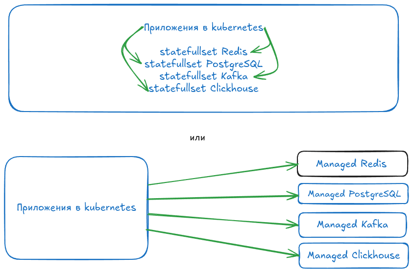

# Маршрутизация трафика к нескольким Redis в другом k8s через один LB используя TLSRoute

Какие проблемы решаем:
 - managed сервисы дорогие, использование statefull сервисов позволяет снизить затраты
 - использование statefull сервисов в том же kubernetes кластере привязывает к версиям операторов что снижает менёрв для обновлений statefull сервисов и операторов

В этом после будем рассматривать подключение к statefull сервисам в другом kubernetes как замена managed сервисов.

Обычно используют statefull сервисы как указал на схеме:



## Установка kubernetes
В директории terraform
```bash
terraform apply -auto-approve
yc managed-kubernetes cluster get-credentials --id id-кластера-k8s --external --force
```
# Настройка маршрутизации трафика на Redis кластеры через TLSRoute с терминацией TLS в Contour

## Введение

В современных Kubernetes-окружениях безопасная маршрутизация трафика к различным сервисам является критически важной задачей. В этой статье мы рассмотрим, как настроить маршрутизацию TLS-трафика к нескольким Redis-кластерам с использованием **Gateway API TLSRoute** и контроллера **Contour** с режимом терминации TLS, когда Redis работает без TLS.

## Архитектура решения

### Компоненты системы

- **Contour**: Ingress-контроллер, реализующий Gateway API
- **Gateway API**: Современная спецификация для управления сетевым трафиком в Kubernetes
- **TLSRoute**: Ресурс для маршрутизации TLS-трафика
- **Redis**: Кластеры баз данных in-memory

### Принцип работы

Решение предусматривает терминацию TLS-соединения на уровне Contour с последующей передачей незашифрованного TCP-трафика к Redis-бэкендам. Это позволяет централизованно управлять сертификатами и снижает нагрузку на Redis-серверы.

## Пошаговая реализация


### 1. Установка Contour

```bash
# Добавление Helm-репозитория Contour
helm repo add contour https://projectcontour.github.io/helm-charts/
helm repo update
```

**Просмотр default значений чарта contour**
Экспортируйте значения по умолчанию чарта Vault в файл default-values.yaml:
```bash
helm show values contour/contour | sed -e '/^\s*#/d' -e 's/\s*#.*$//' -e '/^\s*$/d' > default-values.yaml
```

Удаляем ключи с пустыми значениями
```bash
yq -i 'del(.. | select( length == 0))'  default-values.yaml
sed -i '/{}/d' default-values.yaml
```

### Установка Contour в namespace contour
```bash
helm install contour contour/contour --namespace contour --create-namespace
```

### 2. Настройка GatewayClass и Gateway

```bash
cat <<EOF > gateway.yaml
---
apiVersion: gateway.networking.k8s.io/v1
kind: GatewayClass
metadata:
  name: contour
spec:
  controllerName: projectcontour.io/gateway-controller
---
apiVersion: gateway.networking.k8s.io/v1
kind: Gateway
metadata:
  name: redis-gateway
  namespace: contour
spec:
  gatewayClassName: contour
  listeners:
    - name: redis-cluster-1
      protocol: TLS
      port: 443
      hostname: "redis1.apatsev.corp"
      tls:
        mode: Terminate
        certificateRefs:
          - name: redis1-tls-cert
      allowedRoutes:
        namespaces:
          from: All
    - name: redis-cluster-2
      protocol: TLS
      port: 443
      hostname: "redis2.apatsev.corp"
      tls:
        mode: Terminate
        certificateRefs:
          - name: redis2-tls-cert
      allowedRoutes:
        namespaces:
          from: All
EOF
```

### 1. Установка Redis оператора через Helm (рекомендуемый способ)

#### Добавление репозитория Helm
```bash
helm repo add ot-helm https://ot-container-kit.github.io/helm-charts/
```

#### Установка Redis оператора
```bash
helm upgrade --install redis-operator ot-helm/redis-operator --create-namespace --namespace ot-operators --wait --version 0.22.2
```

#### Проверка установки оператора
```bash
# Проверить поды Redis оператора
kubectl get pods -n ot-operators | grep redis
```

## 2. Установка standalone Redis через YAML-манифест

```bash
cat <<EOF > redis-standalone/redis-standalone.yaml
---
apiVersion: v1
kind: Namespace
metadata:
  name: redis-standalone-ns
---
apiVersion: redis.redis.opstreelabs.in/v1beta2
kind: Redis
metadata:
  name: redis-standalone
  namespace: redis-standalone-ns
spec:
  podSecurityContext:
    runAsUser: 1000
    fsGroup: 1000
  kubernetesConfig:
    image: quay.io/opstree/redis:v7.0.12
  storage:
    volumeClaimTemplate:
      spec:
        accessModes: ["ReadWriteOnce"]
        resources:
          requests:
            storage: 1Gi
EOF
```

### Применение манифеста

```bash
kubectl apply -f redis-standalone/redis-standalone.yaml
```

### Проверка подов Redis

```bash
kubectl get pods -n redis-standalone-ns
```


# Создание сертификатов redis
```
cat <<EOF > my-app-certificate.yaml
apiVersion: cert-manager.io/v1
kind: Certificate
metadata:
  name: redis1-certificate
  namespace: apps
spec:
  secretName: redis1-tls-cert
  issuerRef:
    name: vault-cluster-issuer
    kind: ClusterIssuer
  duration: 720h
  renewBefore: 360h
  commonName: redis1.apatsev.corp
  dnsNames:
  - redis1.apatsev.corp
EOF
```

```
cat <<EOF > my-app-certificate.yaml
apiVersion: cert-manager.io/v1
kind: Certificate
metadata:
  name: redis2-certificate
  namespace: apps
spec:
  secretName: redis2-tls-cert
  issuerRef:
    name: vault-cluster-issuer
    kind: ClusterIssuer
  duration: 720h
  renewBefore: 360h
  commonName: redis2.apatsev.corp
  dnsNames:
  - redis2.apatsev.corp
EOF
```

### 5. Конфигурация TLSRoute

```yaml
apiVersion: gateway.networking.k8s.io/v1alpha2
kind: TLSRoute
metadata:
  name: redis-cluster-1-route
  namespace: redis
spec:
  parentRefs:
    - name: redis-gateway
      namespace: contour
      sectionName: redis-cluster-1
  hostnames:
    - "redis1.apatsev.corp"
  rules:
    - backendRefs:
        - name: redis-cluster-1
          port: 6379
---
apiVersion: gateway.networking.k8s.io/v1alpha2
kind: TLSRoute
metadata:
  name: redis-cluster-2-route
  namespace: redis
spec:
  parentRefs:
    - name: redis-gateway
      namespace: contour
      sectionName: redis-cluster-2
  hostnames:
    - "redis2.apatsev.corp"
  rules:
    - backendRefs:
        - name: redis-cluster-2
          port: 6379
```

## 4. Проверка доступности redis1.apatsev.corp

```bash
kubectl run redis-client --rm -it --restart=Never --image=redis:alpine -- /bin/sh -c "
redis-cli -h redis1.apatsev.corp -p 6379 PING
"
```
